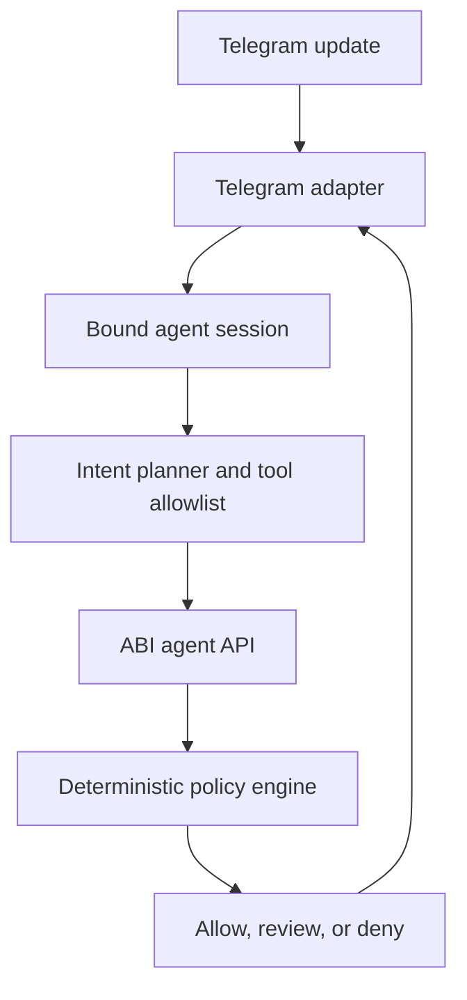

# Telegram agent connection plan

Status: planned, not implemented. This document prepares the next working block without changing the current Telegram approval bot.

## What exists today

ABI already supports a narrow guardian integration:

- the API sends pending approval notifications to one configured Telegram chat;
- authorized Telegram users can approve or deny with inline buttons;
- the API process polls Telegram every four seconds;
- approval resolution uses the same atomic engine as the web console.

This is **not yet an agent connection**. Telegram cannot currently create an agent session, ask an ABI-controlled agent to perform work, run a Playground mission, or submit a new money intent.

## Target experience

An organization owner should be able to connect a Telegram bot to one scoped ABI agent and test a complete interaction:

1. In Console → Developers → Agent connections, select an agent and choose Telegram.
2. ABI creates a one-time, short-lived connection code.
3. The owner sends `/connect CODE` to the bot.
4. ABI binds the Telegram chat and user to the selected organization and agent.
5. The user can ask for budget, simulate a payment, start an approved scenario, or give the connected agent a task.
6. Any proposed financial action still passes through ABI policy. Telegram never receives the agent key, vault key, or private key.
7. Review-sized actions return an approval card; denial reasons are explained in the same chat.

## Proposed architecture

The model may interpret the user's task, but it does not authorize money. The policy engine and signer remain outside the model.

## Security design

- Store `TELEGRAM_BOT_TOKEN` only on the API service.
- Replace the single global `TELEGRAM_CHAT_ID` binding with tenant-scoped connection rows.
- Connection codes expire after ten minutes, are single-use, and store only a hash.
- Bind both Telegram `chat.id` and `from.id`; a forwarded message must not inherit authority.
- Give each binding explicit scopes such as `read`, `simulate`, `run`, and `propose_payment`.
- Start with `read` and `simulate`; require a deliberate console action to enable money proposals.
- Never expose guardian or agent bearer keys to Telegram.
- Require idempotency keys for every action derived from an update.
- Record Telegram update ID, binding ID, agent ID, parsed intent, policy result, and final outcome in the audit log.
- Reject local-network URLs, arbitrary tool names, raw transaction payloads, and attempts to change policy through natural-language chat.
- Apply rate limits per Telegram user, chat, organization, and agent.

## Initial command surface

| Command                      | Scope    | Behavior                                            |
| ---------------------------- | -------- | --------------------------------------------------- |
| `/status`                    | read     | API health, connected organization, and agent state |
| `/budget`                    | read     | Available balance and remaining policy capacity     |
| `/simulate 5 api.openai.com` | simulate | Policy decision without moving money                |
| `/scenario policy_preflight` | run      | Start an allowlisted Playground scenario            |
| `/activity`                  | read     | Recent decisions for the bound agent                |
| `/disconnect`                | owner    | Revoke the Telegram binding                         |

Natural-language tasks should land only after this deterministic command surface is proven.

## Implementation order

### Phase 1 — connection and read-only proof

1. Add `agent_connections` storage with provider, org, agent, external user/chat IDs, scopes, status, and timestamps.
2. Add one-time connection-code endpoints for the console.
3. Extend Telegram update handling to messages as well as approval callbacks.
4. Implement `/connect`, `/status`, `/budget`, `/activity`, and `/disconnect`.
5. Add an Agent connections panel under Developers.

### Phase 2 — safe actions

1. Add `/simulate` and a fixed `/scenario` allowlist.
2. Issue one idempotency key per Telegram update.
3. Display policy outcome, rule IDs, and reasons in Telegram.
4. Add per-binding rate limits and an owner-visible revoke control.

### Phase 3 — natural-language agent tasks

1. Route messages through the existing ABI assistant/tool boundary.
2. Allow only structured tools registered for the bound agent.
3. Show a confirmation preview before submitting any money intent.
4. Preserve human approvals for `review`; Telegram confirmation must never override policy.

### Phase 4 — production transport

1. Replace polling with a verified Telegram webhook endpoint on the persistent API.
2. Verify Telegram's secret webhook header.
3. Queue updates and process them idempotently.
4. Add delivery retries, dead-letter handling, health metrics, and connection diagnostics.

## Test plan

- correct user connects with an unexpired code;
- reused, expired, or wrong-organization codes fail;
- another user in the same chat cannot inherit the binding;
- read-only binding cannot propose money;
- unknown commands cannot reach arbitrary ABI tools;
- duplicate Telegram updates execute at most once;
- policy denial cannot be converted to an approval by the bot;
- review action parks and resumes correctly after an authorized guardian decision;
- revoked or frozen connections stop immediately;
- bot-token rotation does not lose tenant bindings;
- webhook retries do not duplicate payments or scenario runs.

## Definition of done for the first live test

From Telegram, the owner connects a sandbox agent, reads its budget, runs `policy_preflight`, sees allow/review/deny explanations, and disconnects it. No bearer key or signing material appears in Telegram, and every update is visible in ABI's audit trail.
